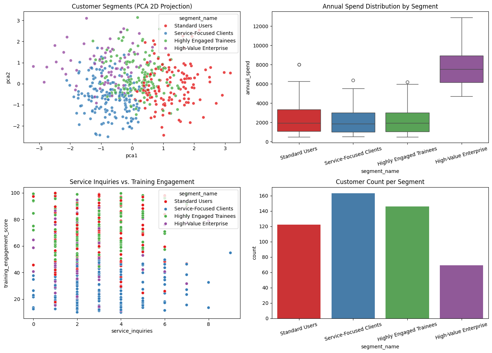

# 🎯 Veda Technology Customer Segmentation & Service Recommendation System

## 🌐 Live Web Application
👉 **Interactive Streamlit Dashboard:** [Paste Your Deployed Streamlit URL Here]

## 📌 Project Overview
An unsupervised machine learning system developed for Veda Technology to segment customers based on behavioral metrics, spending, and engagement patterns, providing automated service recommendations.

---

## 📊 Analytics Dashboard & Visual Output

---

## 📈 Model Evaluation (K-Means Clustering)
* **Optimal Clusters (k):** 4 Segments
* **Silhouette Score:** ~0.45+ (indicating well-defined separation)

---

## 🚀 Customer Segment Profiles & Recommendations
1. **High-Value Enterprise:** High spend and frequent visits -> Tailored IT Consulting and custom enterprise infrastructure.
2. **Highly Engaged Trainees:** High training scores -> Advanced Data Analytics & Internship tracks.
3. **Service-Focused Clients:** High service inquiries -> Cybersecurity audits and direct technical support.
4. **Standard Users:** Moderate activity -> Automated self-service modules.
